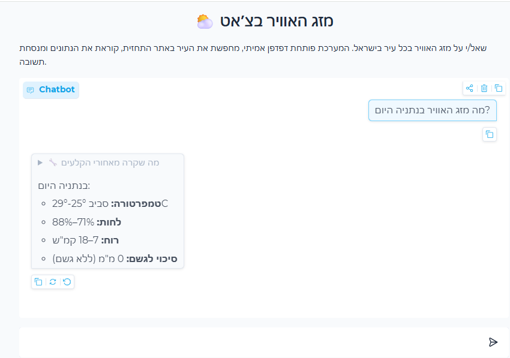

# ⛅ Weather MCP with Playwright

שרת **MCP** עצמאי ששולף תחזית מזג אוויר ישראלית על ידי הפעלת דפדפן אמיתי עם
**Playwright** — במקום קריאה ל‑API. ה‑Host מחבר את הכלים למודל **Google Gemini**,
כך שה‑LLM עונה על שאלת המשתמש ישירות בצ׳אט (מעין RAG מעל תוכן הדף).



## איך זה עובד

1. המשתמש שואל שאלה בצ׳אט (Gradio).
2. Gemini מחליט להפעיל את הכלי `get_israel_forecast`.
3. הכלי מריץ דפדפן Chrome אמיתי: נכנס לאתר התחזית → מקליד את שם העיר →
   בוחר עיר מהרשימה → מחלץ ומנקה את טקסט הדף.
4. הטקסט הנקי חוזר ל‑Gemini, שמנסח תשובה קצרה בשפת המשתמש.

## מבנה הפרויקט

| קובץ | תפקיד |
|---|---|
| `weather_Israel.py` | שרת MCP — כלי Playwright לאתר התחזית הישראלי |
| `weather_USA.py` | שרת MCP — תחזית ארה״ב דרך ה‑API של NWS |
| `client.py` | `MCPClient` — התחברות לשרת MCP דרך stdio |
| `host.py` | `ChatHost` — גשר בין כלי MCP למודל Gemini (לולאת tool‑calling) |
| `app.py` | ממשק צ׳אט ב‑Gradio |

## הכלים

שרת `weather-Israel` — כל הכלים מוגדרים עם `@mcp.tool()` ומחוברים ל‑Host:

**שלב א׳**
- `open_weather_forecast_israel` — פתיחת אתר התחזית
- `enter_weather_forecast_city_israel(city)` — הזנת שם עיר
- `select_weather_forecast_city_israel` — בחירת העיר מרשימת ההשלמה

**שלב ב׳**
- `get_weather_page_content_israel` — חילוץ וניקוי טקסט הדף כדי שה‑LLM יענה מהנתונים

**נוחות**
- `get_israel_forecast(city)` — מריץ את כל הרצף בקריאה אחת (כדי לחסוך בבקשות ל‑Gemini)

## הרצה

דרישות: Python 3.13+, [uv](https://docs.astral.sh/uv/), ו‑Google Chrome מותקן.

```bash
uv sync
```

צרו קובץ `.env`:

```dotenv
GEMINI_API_KEY=...        # מפתח חינם: https://aistudio.google.com/apikey
# WEATHER_HEADLESS=1      # אופציונלי — הרצת הדפדפן ללא חלון גלוי
```

**ממשק גרפי:**

```bash
uv run python app.py     # פותח http://127.0.0.1:7860
```

**טרמינל:**

```bash
uv run python host.py
```

## הערות

- **מכסת Gemini החינמית** מוגבלת במספר בקשות ליום לכל מודל. אם היא נגמרת —
  היא מתאפסת אוטומטית תוך 24 שעות, או שאפשר לשנות את `MODEL` ב‑`host.py`.
- הקוד מגדיר `verify=False` בבקשות ה‑HTTPS כדי לעבור דרך פרוקסי TLS מקומי
  (כגון NetFree).
- `.env` ו‑`.venv/` לא נכללים ב‑git — כל מי שמריץ צריך `.env` משלו.
